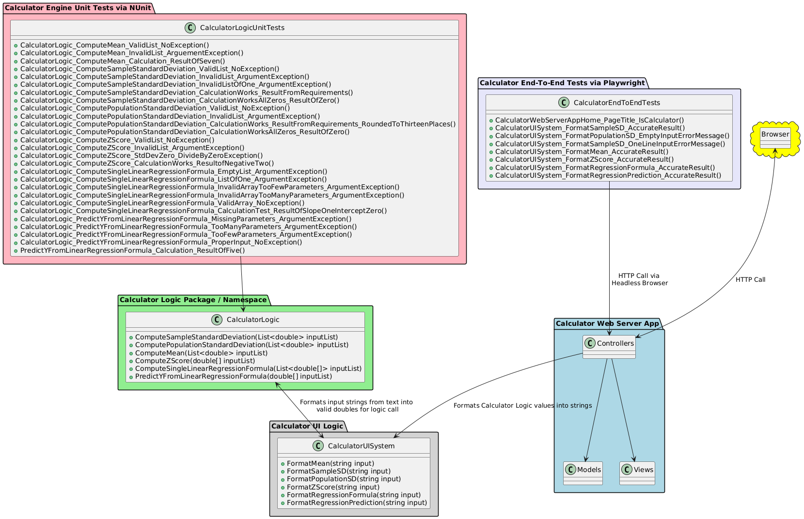
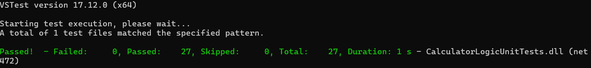
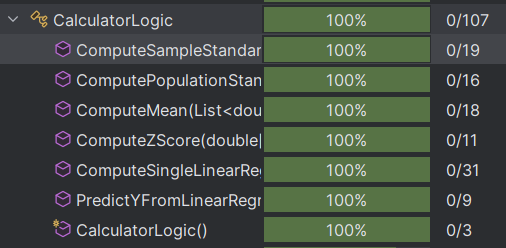
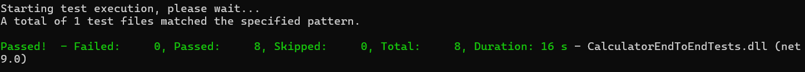

# KSU SWE 3643 Software Testing and Quality Assurance Semester Project: Web-Based Calculator

## Table of Contents
+ [Environment](#environment)
+ [Executing the Web Application](#executing-the-web-application)
+ [Executing Unit Tests](#executing-unit-tests)
+ [Executing Unit Test Coverage](#executing-unit-test-coverage)
+ [Executing End-To-End Tests](#executing-end-to-end-tests)
+ [Final Video Presentation](#final-video-presentation)

## Team Members
+ Duncan Pegram

## Architecture

## Environment
This Application was designed and tested in Windows 11. I cannot promise that it will work on any other platform.
Ideally everything needed should work with what's included in the GitHub, at most you might need to download Playwright and PowerShell.
## Executing the Web Application
Open the command line, then type:
```
"<project file path>\src\Calculator\CalculatorWebServerApp\bin\Debug\net9.0\CalculatorWebServerApp.exe"
```
You should see a section of the running file that says "now listening on:" followed by a link to a localhost port. Copy that link into your browser to view the page while the program is running.
## Executing Unit Tests
Open the command line, then type:
```
dotnet test "<project file path>\src\Calculator\CalculatorLogicUnitTests\bin\Debug\CalculatorLogicUnitTests.dll"
```

## Reviewing Unit Test Coverage

## Executing End-To-End Tests
Note: The web server app must be running to execute end-to-end tests.
Open the command line, then type:
```
dotnet test "<project file path>\src\Calculator\CalculatorEndToEndTests\bin\Debug\CalculatorEndToEndTests.dll"
```

## Final Video Presentation